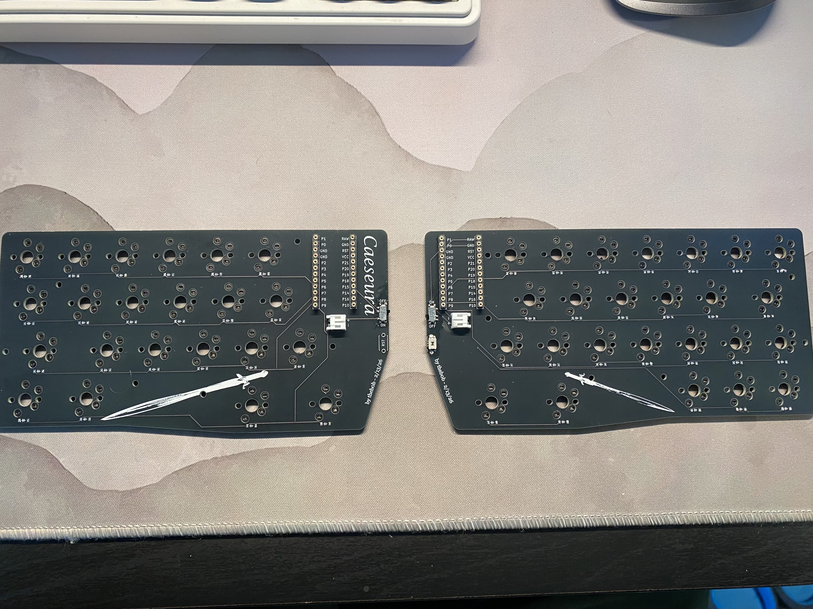
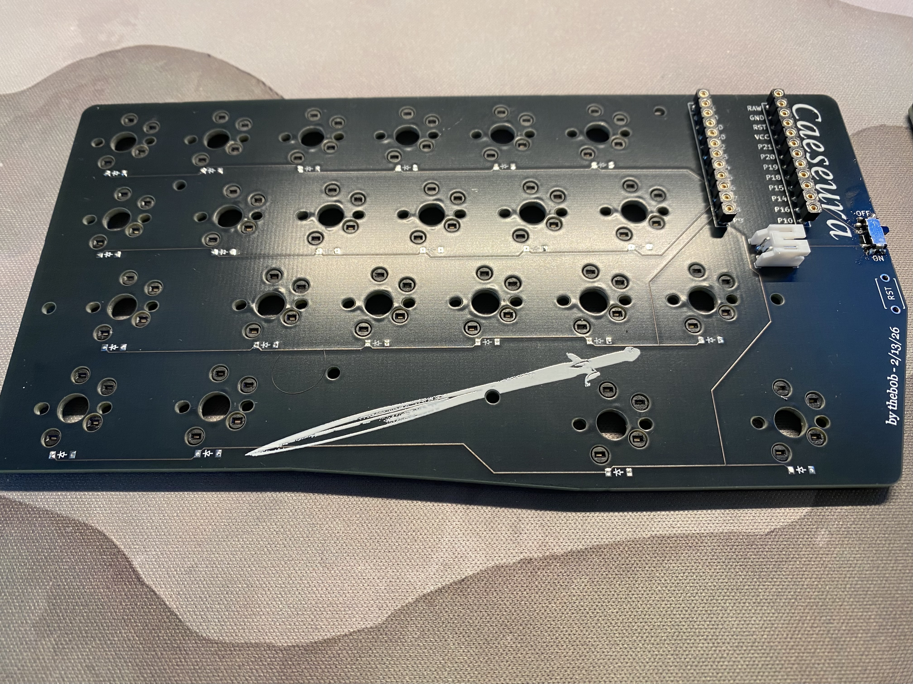
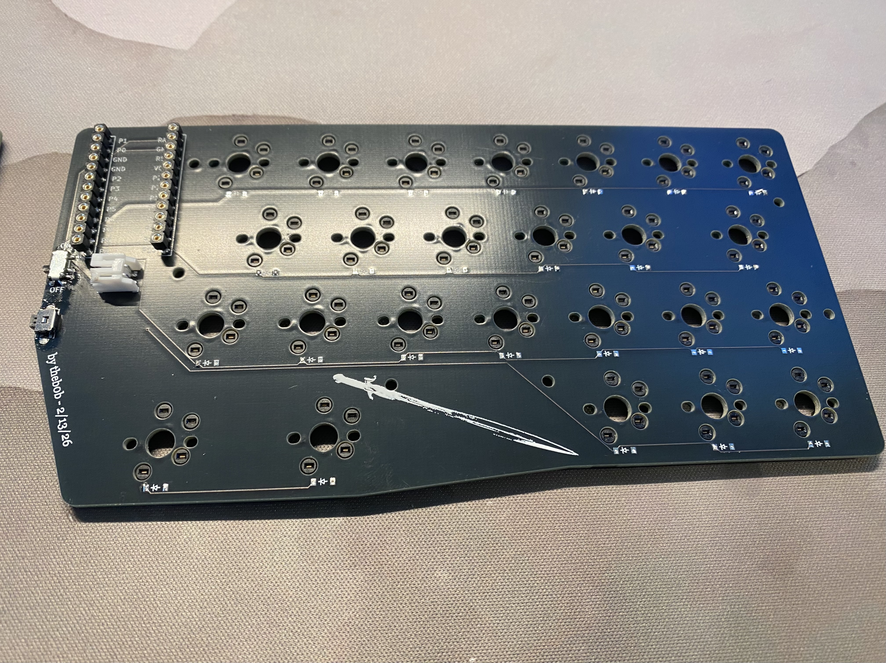
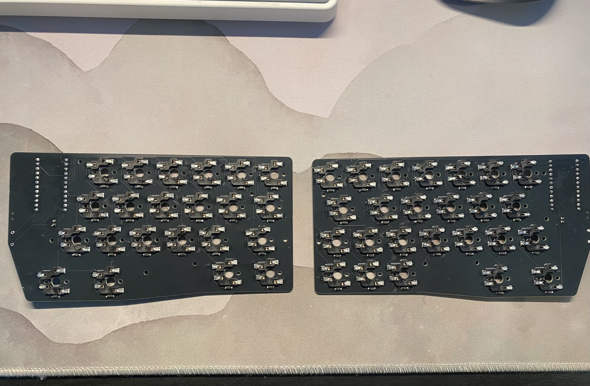
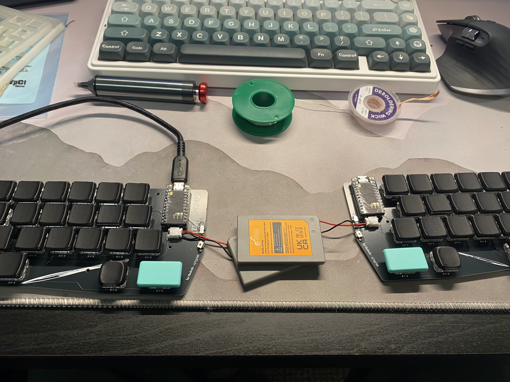
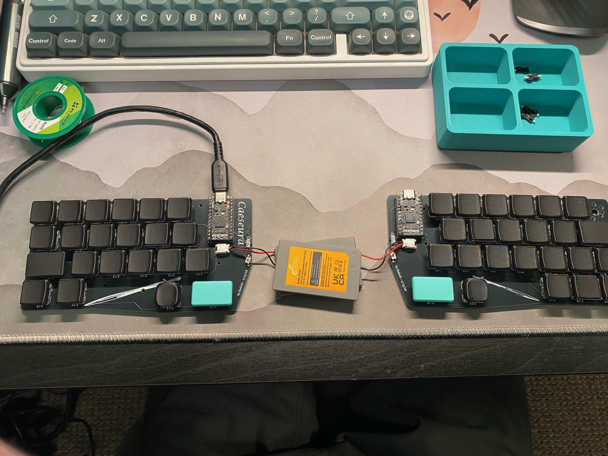
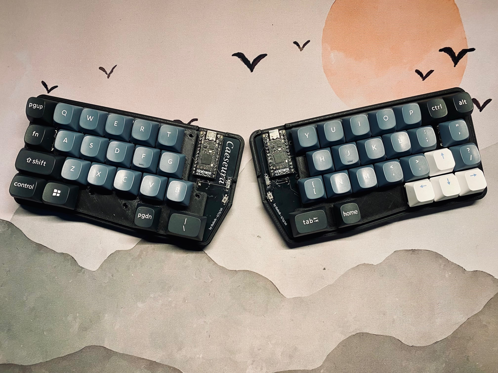
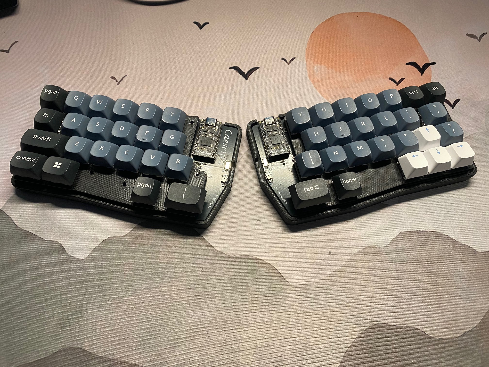
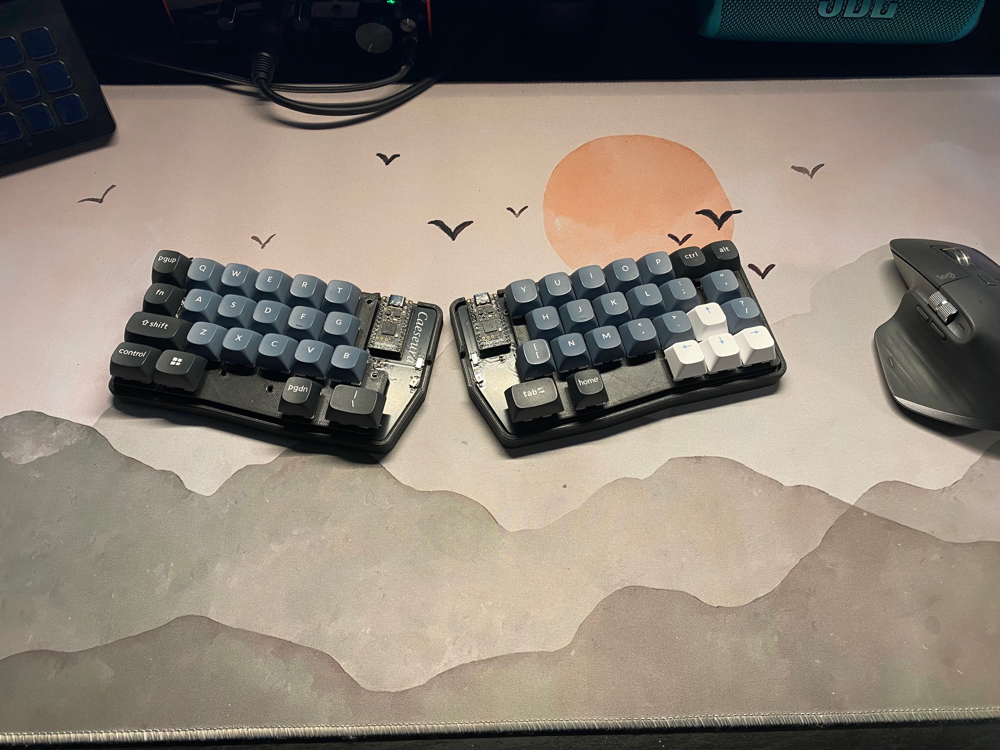

# Caeseura

**cae·sue·ra**
/siːˈzʊrə/

**noun**

1. a pause or break in the middle of a line of poetry, often used for emphasis or to create rhythm.
   - "Shall I compare thee to a summer's day? // Thou art more lovely and more temperate."*
2. a natural pause or interruption in speech or music.
   - "His sentence had a long caesura, as if he were searching for the right words."*
3. *(wordplay)* one who splits; something that divides or separates into two parts.

***etymology***

Altered spelling of *caesura*, intentionally adding **e** as wordplay, referencing the city of **Céüse** in France, the sword **Caesura** from *The Kingkiller Chronicle*, and the concept of splitting or dividing.

---

## Photos

| | |
|---|---|
|  |  |
|  |  |
|  |  |
|  |  |
|  |  |
|  |  |
|  | |

---

## Features

- **47 keys** — row-staggered layout with a traditional feel and a compact footprint
- **Split design** — two halves, place them wherever feels natural for your shoulders
- **MX & Choc compatible** — hotswap sockets support MX, Choc v1, and Choc v2 switches simultaneously; no resoldering needed to switch between them
- **Wireless** — powered by the [nice!nano v2](https://nicekeyboards.com/nice-nano/) and [ZMK firmware](https://zmk.dev/), completely cable-free between halves
- **Per-side batteries** — each half has its own JST PH 2-pin battery connector and SMD power switch; battery can be tucked under the PCB
- **SMD diodes** — SOD-123 footprint, one per key
- **Ergogen-designed PCB** — generated with [Ergogen](https://ergogen.xyz/) using the ceoloide footprint library; fully open source
- **3D printed case** — printed bottom, wall, and switch plate; STL/step files included in `cases/`
- **6 mounting holes per half** — M2 screws and standoffs for a solid, rattle-free build
- **Reset button** — through-hole, top accessible, no case disassembly needed
- **Open source** — PCB sources, case files, ZMK config, and Ergogen YAML all included

### Layout

The left half carries a standard row-stagger with modifier keys (Escape, Tab, Shift, Control, Super) sized at 1u–1.75u, plus a two-key thumb cluster. The right half mirrors the stagger with a seven-key top number row, standard alpha/symbol columns, a three-key arrow cluster, and a two-key thumb cluster.

---

## Bill of Materials (BOM)

*Quantities are per half unless noted as "total".*

| Item | Qty (per half) | Notes |
|---|---|---|
| Caeseura PCB | 1 | See `pcbs/` — order from your preferred PCB fab (JLCPCB, PCBWay, etc.) |
| nice!nano v2 | 1 | nRF52840-based wireless MCU |
| Mill-Max 315 or 12-pin sockets | 2 rows | Recommended — lets you remove the nice!nano |
| MX hotswap sockets | up to 24 | Kailh CPG151101S11 |
| Choc v1/v2 hotswap sockets | up to 24 | Kailh CPG135001S30 — both MX and Choc sockets can be installed; use one type of switch at a time |
| SOD-123 SMD diodes (1N4148W) | 24 | One per key |
| JST PH 2-pin battery connector | 1 | Right-angle, SMD |
| LiPo battery | 1 | 301230 or similar slim cell; must fit under the PCB |
| SMD power switch | 1 | Panasonic EVQ-PAD04M or compatible side-mount |
| Through-hole reset switch | 1 | 3×6mm or 4×4mm tactile, top-mount |
| M2 screws | 6 | 6–8mm length |
| M2 standoffs | 6 | Height depends on case — ~5mm for printed case |
| MX or Choc switches | up to 24 | Your choice |
| Keycaps | up to 24 | MX or Choc profile to match your switches |
| 3D printed case parts | 1 set | Bottom, wall, switch plate — see `cases/` |

**Total keys: 47** (24 left + 23 right, including thumb clusters)

---

## Build Guide

### Tools needed

- Soldering iron + solder (fine tip recommended for SMD work)
- Flux
- Tweezers
- Multimeter (optional but helpful for continuity testing)
- 3D printer or access to one (for case)
- M2 screwdriver

---

### Step 1 — Order the PCBs

Use the production files in `pcbs/leftsidev2_withSS.zip` and `pcbs/rightsidev2_withSS.zip`. Upload the appropriate zip to your PCB fab. Recommended settings:

- **Layers:** 2
- **Thickness:** 1.6mm
- **Finish:** HASL or ENIG
- **Color:** your choice

---

### Step 2 — Print the case

Print the files from the `cases/` folder. The case consists of a bottom plate, a wall, and a switch plate. Recommended print settings:

- **Material:** PLA or PETG
- **Layer height:** 0.2mm
- **Infill:** 20%+ for the walls
- **Supports:** may be needed for the wall piece depending on orientation

---

### Step 3 — Solder the SMD diodes

Solder one SOD-123 diode per switch position. Each diode is marked on the silkscreen — match the cathode stripe on the diode to the line on the footprint. The diodes are located 8mm below each switch position.

> **Tip:** Pre-tin one pad, place the diode, reflow, then solder the second pad.

---

### Step 4 — Solder the hotswap sockets

Install MX and/or Choc hotswap sockets depending on your switch preference. Both footprints are present on the PCB — you can populate both if you want to swap between switch types later, or just the ones you plan to use. Pre-tin one pad, hold the socket flush against the PCB, reflow, then solder the second pad.

---

### Step 5 — Solder the power switch and reset button

- **Power switch (SMD):** Solder the side-mount power switch. It connects `BAT_P` to `RAW`.
- **Reset switch (THT):** Insert the through-hole tactile switch from the top of the PCB and solder from the underside.

---

### Step 6 — Install the battery connector

Solder the JST PH 2-pin connector. Double-check polarity before connecting a battery — red to `+`, black to `GND`. The connector is positioned to allow the battery to sit under the PCB.

---

### Step 7 — Install the nice!nano

Socket the nice!nano using Mill-Max 315 sockets (strongly recommended) or solder it directly. The MCU sits face-up on the PCB. Pin 1 is marked on both the PCB silkscreen and the nice!nano.

---

### Step 8 — Flash ZMK firmware

1. Clone or fork the ZMK config from `zmk-config-caeseura/`
2. Set up ZMK following the [ZMK getting started guide](https://zmk.dev/docs/user-setup)
3. Put the nice!nano into bootloader mode by double-tapping the reset button — it will appear as a USB drive
4. Drag and drop the compiled `.uf2` file onto the drive
5. Repeat for the other half

---

### Step 9 — Test

Before assembling into the case, plug in the left half (the central/USB half) and test each key using a keyboard tester. Use tweezers to short each hotswap socket pair if switches aren't installed yet.

---

### Step 10 — Assemble the case

1. Insert the standoffs into the mounting holes on the PCB
2. Place the PCB into the case wall
3. Attach the bottom plate with M2 screws
4. Snap or screw the switch plate on top
5. Install switches into the hotswap sockets
6. Install keycaps
7. Connect the battery and flip the power switch

---

## Credits

### Designer

Built and designed by **[@theb0b12](https://github.com/theb0b12)**.

### Special Thanks

A **massive** shoutout to **[@stardustArc](https://github.com/stardustArc)** (Discord: `@fuzzytomatohead_`) — she essentially walked through the entire design and build process step by step. This keyboard would not exist without her help.

Big thanks to **[@zakwaykway](https://github.com/zakwaykway)** for his knowledge about switches and switch footprints — invaluable when figuring out the dual MX/Choc hotswap setup.

Shoutout to the **[Ergogen Discord](https://discord.gg/ergogen)** and the **[ZMK Discord](https://zmk.dev/community)** communities — the collective knowledge in both servers made this project possible.

Thanks to **[@genteure](https://github.com/genteure)** for his help with the board shield and his excellent tool **[ZMK Shield Wizard](https://shield-wizard.genteure.workers.dev/)**, which makes setting up custom ZMK shields dramatically easier.

### Tools & Libraries

- **[Ergogen](https://ergogen.xyz/)** — PCB and case generation
- **[ceoloide footprint library](https://github.com/ceoloide/ergogen-footprints)** — KiCad footprints used for all components
- **[ZMK Firmware](https://zmk.dev/)** — wireless keyboard firmware
- **[nice!nano](https://nicekeyboards.com/nice-nano/)** — wireless MCU
- **[ZMK Shield Wizard](https://shield-wizard.genteure.workers.dev/)** — board shield generation by @genteure
- **[Keymap Layout Tools](https://nickcoutsos.github.io/keymap-layout-tools/)** — layout visualization and editing
- **[Keymap Editor](https://nickcoutsos.github.io/keymap-editor/)** — visual ZMK keymap editor by @nickcoutsos

---

## License

This project is open source. PCB design files, case files, and ZMK config are free to use, modify, and build from. If you make changes and share them, a link back here would be appreciated.