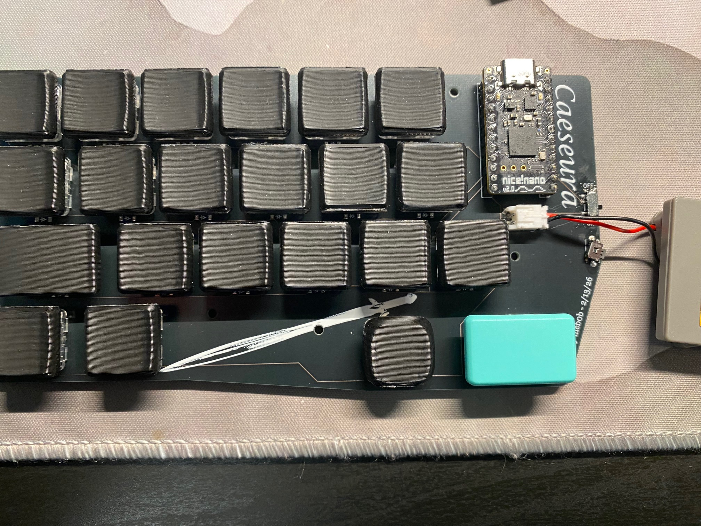
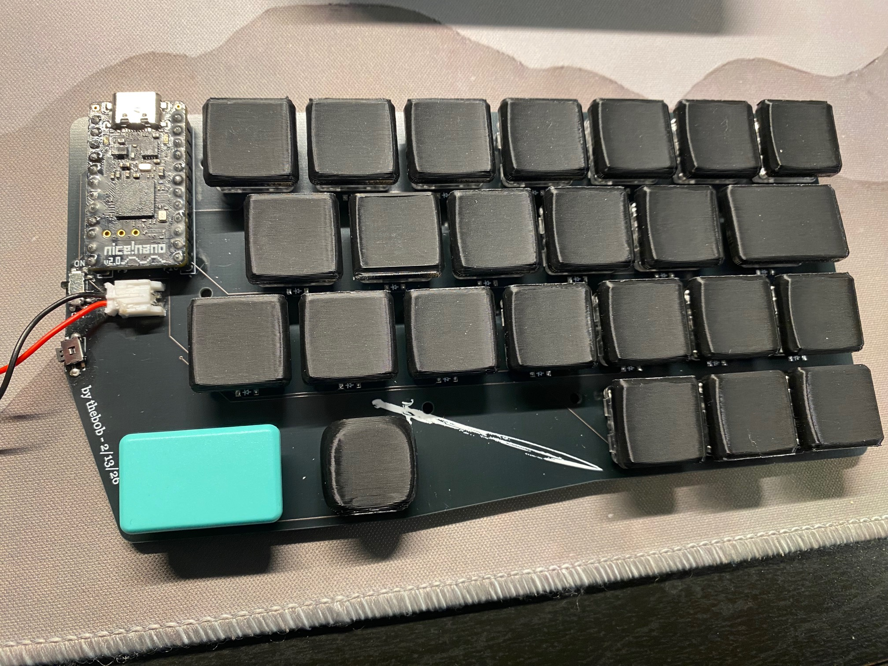
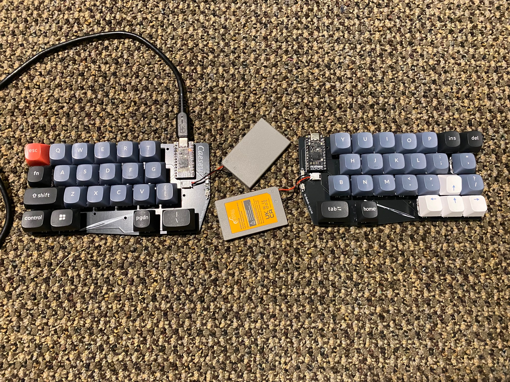
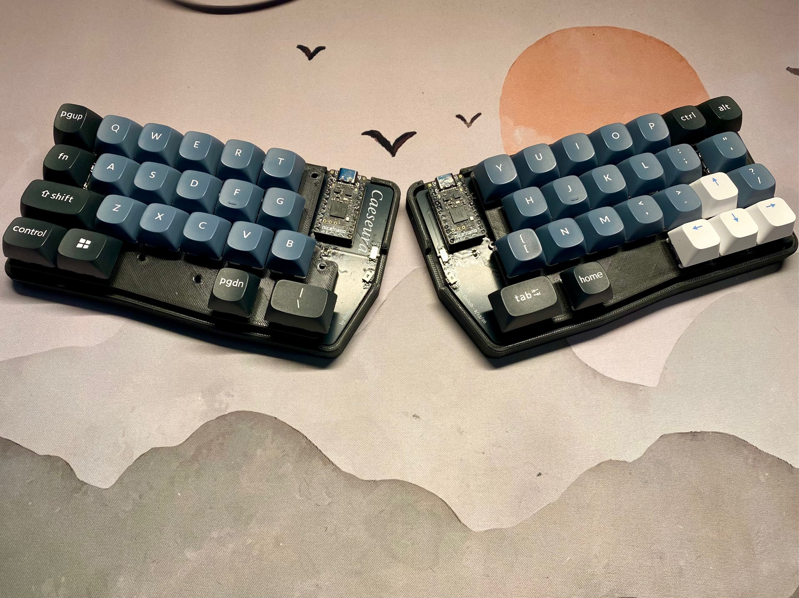
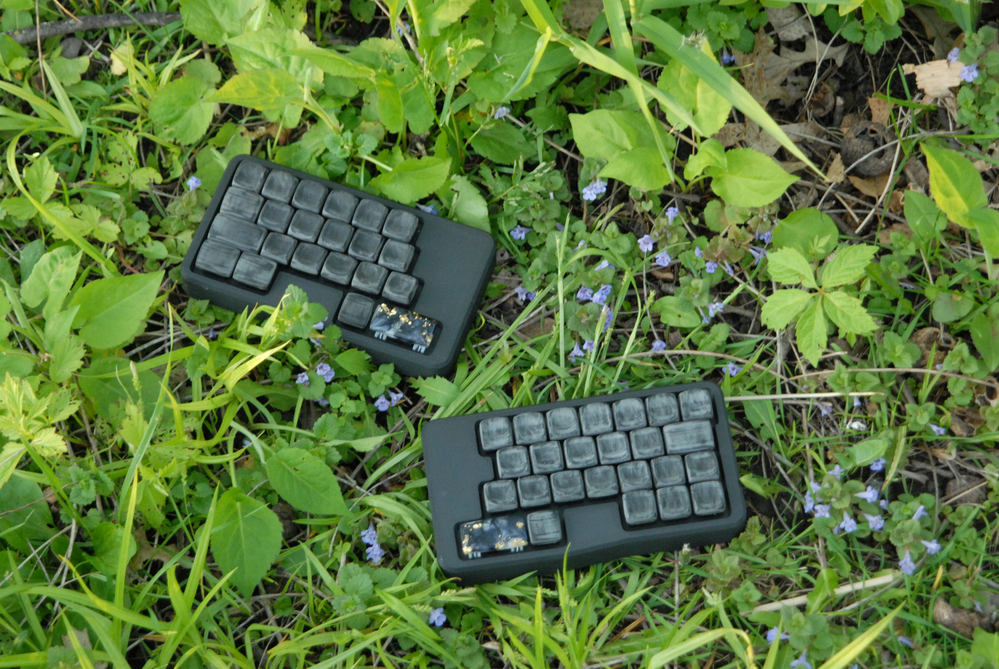
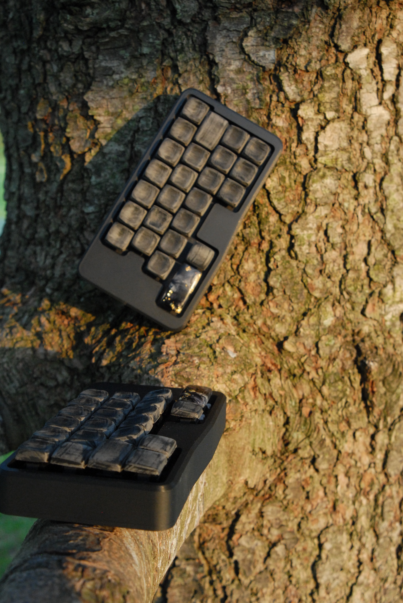

# Caeseura

**cae·sue·ra**
/siːˈzʊrə/

**noun**
1. in modern prosody : a usually rhetorical break in the flow of sound in the middle of a line of verse
2. break, interruption
    > "a *caesura* between the movie and its sequel"
3.  a pause marking a rhythmic point of division in a melody

[credit](https://www.merriam-webster.com/dictionary/caesura)

***etymology***

Altered spelling of *caesura*, intentionally adding the **e** as wordplay, referencing the spelling of the city of **Céüse** in France, a very cool sport climbing destiation and host to some of the hardest routes in the world. The sword **Caesura** from *The Kingkiller Chronicle*, great book btw. And the concept of splitting or dividing (get it, split keybs).

---

## Photos

|                                                         |                                                  |
| ------------------------------------------------------- | ------------------------------------------------ |
|               |       |
|  |    |

---

## Builds

Lu's Build, with a custom case and nice Asymplex keycaps and 3D printed SC keycapys

## Features

- **47 keys**
- **Row Staggerd**
- **Split design**
- **MX & Choc compatible** - hotswap sockets, choc v1 and v2 (if you snip the extra pin)
- **Wireless** - powered by the [nice!nano v2](https://nicekeyboards.com/nice-nano/) and [ZMK firmware](https://zmk.dev/)
- **Open source** - PCB gerbers + kicad files, case files, ZMK config, and Ergogen YAML

---

## Bill of Materials (BOM)

This is the exact BOM used for the my build. Total cost will vary depending on switch choice, shipping, and discounts.

| Item                                      | Qty     | Unit Price      | Total                                                                                                          | Link                                        |
| ----------------------------------------- | ------- | --------------- | -------------------------------------------------------------------------------------------------------------- | ------------------------------------------- |
| nice!nano v2                              | 2       | $25.00 | $50.00 | [Typeractive](https://typeractive.xyz/products/nice-nano)                                                         |                                             |
| Battery (PS3 controller replacement LiPo) | 1 set   | $15.49 | $15.49 | [Amazon](https://www.amazon.com/dp/B09726K2LC)                                                                    |                                             |
| PCB (left + right)                        | 1 set   | $27.00 | $27.00 | JLCPCB                                                     |                                             |
| Switches (Choc)                           | ~47 | - | - | personal choice                                                                    |                                             |
| Choc hotswap sockets (x10)                | 5 packs | $1.50 | $7.50   | [Typeractive](https://typeractive.xyz/products/hotswap-sockets?variant=45742200324327)                            |                                             |
| MX hotswap sockets                        | 5 packs | $1.50 | $7.50   | [Typeractive](https://typeractive.xyz/products/hotswap-sockets?variant=45742200291559)                            |                                             |
| Reset switch (Panasonic EVQ-PUA02K)       | 3       | $0.67 | $2.01   | [Digikey](https://www.digikey.com/en/products/detail/panasonic-electronic-components/EVQ-PUA02K/286334)           |                                             |
| Power switch (SMD)                        | 2 packs | $1.50 | $3.00   | [Typeractive](https://typeractive.xyz/products/power-switch)                                                      |                                             |
| JST PH 2-pin battery connector            | 2       | $0.10 | $0.20   | [Digikey](https://www.digikey.com/en/products/detail/jst-sales-america-inc/S2B-PH-K-S/926626)                     |                                             |
| Keycaps                                   | ~47     | -     | -                                                                                                             | personal choice
| SOD-123 diodes (1N4148W)                  | 50      | $0.0495 | $2.48 | [Digikey](https://www.digikey.com/en/products/detail/diotec-semiconductor/1N4148W/18833653)                       |                                             |
| Mill-Max 310 board sockets                | 6       | $1.43 | $8.58   | [Digikey](https://www.digikey.com/en/products/detail/mill-max-manufacturing-corp/310-47-112-41-001000/7364039)    |                                             |
| Mill-Max 3320 pins                        | 65      | $0.0876 | $5.69 | [Digikey](https://www.digikey.com/en/products/detail/mill-max-manufacturing-corp/3320-0-00-15-00-00-03-0/4147392) |                                             |
| Adhesive rubber feet                      | 1 pack  | $6.99 | $6.99   | [Amazon](https://www.amazon.com/dp/B0DXH5D1FQ)                                                                    |                                             |
| M2x6mm FHCS screws                        | 1 pack  | $8.69 | $8.69   | [Amazon](https://www.amazon.com/dp/B01MYRN6A1)                                                                    |                                             |
| M2 heat-set inserts                       | 1 pack  | $6.99 | $6.99   | [Amazon](https://www.amazon.com/dp/B0FJXLNMLM)                                                                    |                                             |

---

## Build Guide

WIP

---

## Credits

### Designer

Built and designed by **[@theb0b12](https://github.com/theb0b12)**.

### Special Thanks

A **massive** shoutout to **[@stardustArc](https://github.com/stardustArc)** (Discord: `@.fuzzytomatohead`) - she essentially walked me through the entire design and build process step by step. This keyboard would not exist without her help.

Big thanks to **[@zakwaykway](https://github.com/zakwaykway)** for his knowledge about switches and switch footprints, it invaluable when figuring out the dual MX/Choc hotswap setup.

Shoutout to the **[Ergogen Discord](https://discord.com/invite/DbCfZfZ)** and the **[ZMK Discord](https://discord.com/invite/sycytVQ)** communities - the collective knowledge in both servers made this project possible.

Thanks to **[@genteure](https://github.com/genteure)** for his help with the board shield and his excellent tool **[ZMK Shield Wizard](https://shield-wizard.genteure.workers.dev/)**, which makes setting up custom ZMK shields dramatically easier.

### Tools & Libraries

- **[Ergogen](https://ergogen.xyz/)** - PCB and case generation
- **[ceoloide footprint library](https://github.com/ceoloide/ergogen-footprints)** - KiCad footprints used for all components
- **[ZMK Firmware](https://zmk.dev/)** - wireless keyboard firmware
- **[nice!nano](https://nicekeyboards.com/nice-nano/)** - wireless MCU
- **[ZMK Shield Wizard](https://shield-wizard.genteure.workers.dev/)** - board shield generation by @genteure
- **[Keymap Layout Tools](https://nickcoutsos.github.io/keymap-layout-tools/)** - layout visualization and editing
- **[Keymap Editor](https://nickcoutsos.github.io/keymap-editor/)** - visual ZMK keymap editor by @nickcoutsos

---

## License

This project is open source with the MIT license. PCB design files, case files, and ZMK config are free to use, modify, and build from. If you make changes and share them, a link back here would be appreciated.
